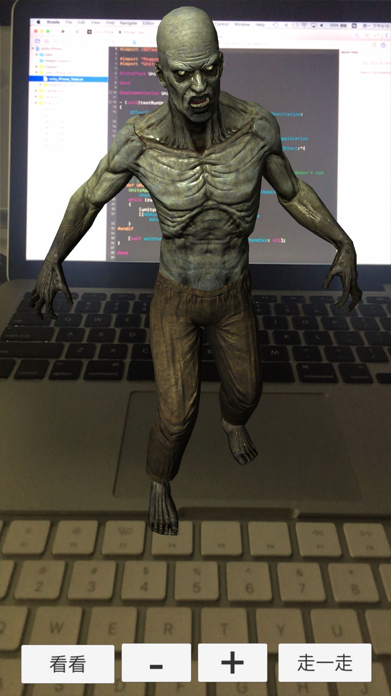

# Apple ArKit Augmented Reality App
 

Code examples for Unity of iOS 11.

**Note**: The project requires Xcode 9 Beta 1 or later, Unity 5.6.1p1 and iOS 11.

## Contents

### [ARKit Unity Demo 密码：hkhe](https://pan.baidu.com/s/1c10t5ra)

Demo 的实现需要基于 Xcode 9 beta, iOS 11 beta, the Arkit Unity package, 新版 Unity 5.6.1p1。
具体的实现步骤，可参考 YouTube 上的大神 matthewh8 视频，地址：https://www.youtube.com/watch?v=S7kKQZuOdlk (需翻墙)
文本说明：http://www.instructables.com/id/Apple-ArKit-Augmented-Reality-App/

效果展示：

## Author

BaseBBHuang
